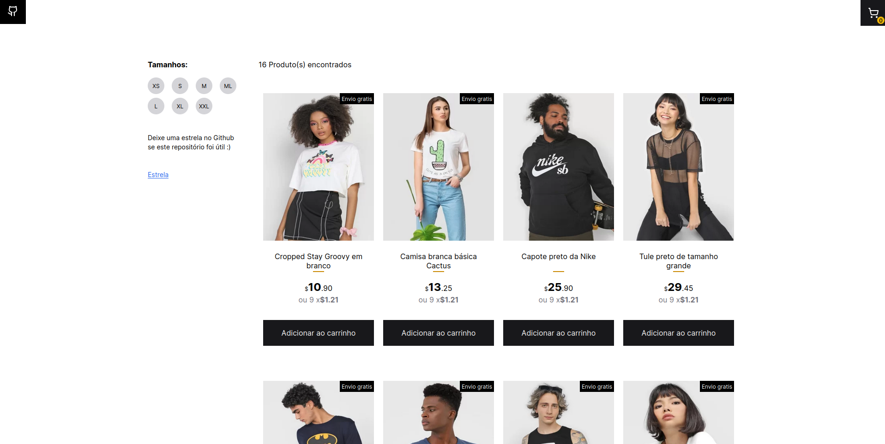

## 🛍️ Uma aplicação simples de carrinho para ecommerce

<p align="center">
  
</p>

<!-- ## Basic Overview - [Live Demo](https://react-shopping-cart-67954.firebaseapp.com/) -->

✈️ [Me siga no LinkedIn](https://www.linkedin.com/in/samsepi0ldev/)

Este protótipo simples de carrinho de compras mostra como React com Typescript, React hooks, react Context e Styled Components podem ser usados para construir uma experiência de usuário amigável com atualizações visuais instantâneas e código escalonável em aplicativos de comércio eletrônico.

#### Features

- Adicionar e remover produtos do carrinho flutuante usando Context Api
- Filtre produtos por tamanhos disponíveis usando Context Api
- Design responsivo

<!--
## Getting started

Try playing with the code on CodeSandbox :)

[](https://codesandbox.io/s/74rykw70qq)
 -->

## Build/Run

#### Requirements

- Node.js
- npm
- pnpm

```javascript

/* First, Install the needed packages */
pnpm install

/* Then start the React app */
pnpm run dev

```